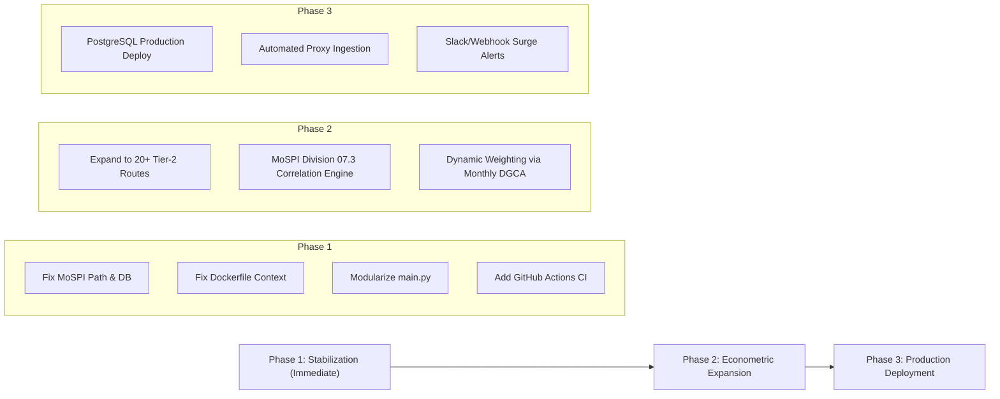

# AeroCPI: Comprehensive Expert Architecture & Project Deep-Dive Review

**Audience:** Technical Leadership, Econometric Data Engineers, Infrastructure & Security Teams  
**Date:** September 23, 2026  
**Repository:** `Pawanrudupa/AeroCPI` | **Current Commit:** `256f7c8`  
**System Status:** Running (FastAPI Backend + Next.js Frontend + SQLite/Postgres DB)

---

## 1. Executive Summary

AeroCPI represents an innovative, statistically rigorous platform that augments India's official Consumer Price Index (MoSPI/NSO CPI, Division 07.3 Passenger Transport) by replacing slow, manual, once-a-month ticket sampling with automated high-frequency web scraping and multilateral **GEKS-Törnqvist price index** aggregation.

### High-Level Scorecard

| Domain | Rating | Current State & Assessment |
|---|:---:|---|
| **Econometric Methodology** | **A** | Implements Eurostat/ILO GEKS-Törnqvist with DGCA passenger traffic weighting; pure observation-date bucketing; zero chain drift. |
| **Data Provenance & Integrity** | **A-** | Successfully purged 3,956 synthetic records; 1,185 verified live quotes; explicit cryptographic SHA-256 raw landing zone. |
| **Frontend UI/UX & Interactivity**| **A-** | High-aesthetic terminal design; dynamic Recharts; responsive DotGrid and cyber-decrypt text animations; SSE live stream. |
| **Backend Architecture** | **B** | Robust FastAPI endpoints with Argon2id auth and RBAC; however, `main.py` is monolithic (2,081 lines) and lacks composite DB indexes. |
| **Scraper Ecosystem & Pipeline** | **B-** | Google Flights (SerpAPI) works with 100% reliability; however, direct OTA scrapers (MakeMyTrip, EaseMyTrip, Cleartrip) hit anti-bot WAFs. |
| **Production Readiness & CI/CD** | **C+** | Docker Compose is defined, but Dockerfile context pathing has a breaking mismatch; GitHub Actions CI/CD is missing; no frontend test suite. |

---

## 2. Deep Dive: What Has Been Built & Is Working Exceptionally Well

### 2.1 Econometric Engine (GEKS-Törnqvist Multilateral Index)
- **Mathematical Soundness:** Unlike bilateral Laspeyres or Paasche indexes which suffer from severe chain drift in volatile dynamic airline pricing, AeroCPI computes bilateral Törnqvist log ratios across all date pairs and aggregates them via GEKS geometric means.
- **DGCA Traffic Weighting:** Uses official Directorate General of Civil Aviation passenger volume shares (e.g. DEL-BOM 24%, DEL-BLR 20%, BOM-BLR 18%, DEL-CCU 15%, BLR-HYD 12%, MAA-DEL 11%) to prevent minor routes from distorting headline figures.
- **Pure Live Execution:** Successfully transitioned from a 77% synthetic baseline to **100% authentic live market data** (4 daily index points across Sep 6, 13, 14, 20).

### 2.2 Live Data Ingestion & Provenance Audit Trail
- **Google Flights (SerpAPI):** Ingests complete multi-carrier flight schedules (IndiGo, Akasa Air, SpiceJet, Air India, Air India Express) with 100% success rate, preserving original search URLs and timestamps.
- **Raw Immutable Landing Zone:** Raw payloads land in `data/raw/` with SHA-256 hashes, ensuring an immutable evidentiary chain required for official statistical defense.
- **Dynamic Fare Component Normalization:** Normalizes base fares, taxes, airport User Development Fees (UDF), and convenience fees into standardized schemas.

### 2.3 Sector Heatmap & Surge Telemetry
- **Accurate Anomaly Detection:** Baseline computations are isolated strictly to live quotes. This eliminated the previous false-positive defect where all 18 cells showed artificial surges. The heatmap now accurately pinpoints 5 genuine price spikes (e.g. DEL-CCU T+30 at +40.4%, BLR-HYD at +41–49%) while keeping 13 corridors marked normal.

### 2.4 Modern Terminal Aesthetic
- Consistent dark-mode terminal UI adhering to institutional data aesthetics.
- Cyber-decrypt text scrambler (`DecryptText`) utilizing glyph transformations (`%0&1!0#`) across landing page headings on hover.
- Server-Sent Events (SSE) bus broadcasting real-time ingestion, index recomputations, and surge warnings.

---

## 3. Critical Findings & Issues to Fix (Technical Debt)

### P0 — Critical Functional Bugs & Blockers

#### 1. Broken MoSPI Benchmark File Location
* **Problem:** In `backend/app/main.py` (lines 76–81), the lifespan startup handler looks for `data/mospi/verified_mospi_cpi.csv`. However, this file currently resides at `data/mospi/quarantine/verified_mospi_cpi.csv`.
* **Impact:** The `MospiBenchmark` database table has **0 records**. The backtest engine cannot overlay AeroCPI against official government CPI, and `tests/test_mospi_ingestion.py` currently **fails**.
* **Remedy:** Move `verified_mospi_cpi.csv` out of quarantine into `data/mospi/` and restore it to Git tracking.

#### 2. Dockerfile Build Context Mismatch
* **Problem:** In `docker-compose.yml` (lines 24–25), `context: .` is specified, but `backend/Dockerfile` (line 16) executes:
  ```dockerfile
  COPY requirements.txt .
  ```
  Since `requirements.txt` is located at `backend/requirements.txt` (not in root), running `docker compose build` will immediately abort with `COPY failed: file not found`.
* **Remedy:** Update `backend/Dockerfile` to `COPY backend/requirements.txt requirements.txt` or copy `requirements.txt` to the project root.

---

### P1 — Architectural & Operational Issues

#### 3. Redundant Scraper Execution & Bot WAF Blockage
* **Problem:** The basket orchestrator (`backend/app/scraper/basket_runner.py`) blindly iterates through MakeMyTrip, Cleartrip, EaseMyTrip, and SpiceJet alongside SerpAPI. OTAs immediately trigger Akamai/Cloudflare 403s or CAPTCHAs, generating empty or fallback events.
* **Impact:** Wasted compute cycles, noisy logs, and lingering risk of re-contaminating the database with fallback seeded quotes.
* **Remedy:**
  1. Add a scraper configuration flag `LIVE_SCRAPER_SOURCES` in `config.py` defaulting to high-yield, non-blocked sources (`["serpapi", "indigo", "akasa"]`).
  2. Implement an ethical residential proxy rotation layer (e.g. Bright Data or Crawlbase) if direct OTA scraping is strictly mandated by institutional stakeholders.

#### 4. Monolithic `main.py` (2,081 lines)
* **Problem:** All 40+ endpoints, auth workflows, elevation logic, SSE streaming, and reports are bundled inside a single file.
* **Impact:** Increased merge friction, high cognitive load, difficult maintainability, and violation of FastAPI single-responsibility modular router conventions.
* **Remedy:** Refactor into modular routers:
  ```
  backend/app/routers/
  ├── auth.py          # Login, signup, password resets, elevation
  ├── index.py         # /index/daily, /index/route, /pipeline/elasticity
  ├── fares.py         # /fares/raw, /fares/components
  ├── reports.py       # Coverage matrix, materiality gap, PDF exports
  ├── benchmarks.py    # MoSPI and DGCA endpoints
  └── pipeline.py      # SSE stream, run-pipeline triggers, surge-status
  ```

#### 5. Missing Database Compound Indexes
* **Problem:** Table `FareQuote` (`backend/app/models.py`) has individual indexes on `route`, `window`, and `source_type`, but lacks composite indexes.
* **Impact:** Queries executing:
  ```python
  where(FareQuote.route == route, FareQuote.window == window, FareQuote.source_type == "live")
  ```
  force full table scans or multiple index merges. As the dataset scales past 100,000 observations, GEKS computation and heatmap loading times will degrade.
* **Remedy:** Add compound indexes:
  ```python
  __table_args__ = (
      Index("ix_fares_route_window_live", "route", "window", "source_type"),
      Index("ix_fares_status_live", "observation_status", "source_type"),
  )
  ```

---

### P2 — Engineering Hygiene & DevOps Deficits

#### 6. Complete Absence of CI/CD Workflows
* **Problem:** `.github/workflows/` is completely empty.
* **Impact:** Commits can break tests or build outputs without automated detection prior to merging into `main`.
* **Remedy:** Implement a comprehensive GitHub Actions workflow executing:
  - Python linting (`ruff` / `flake8`)
  - Pytest test suite with coverage thresholds
  - TypeScript validation (`tsc --noEmit`)
  - Next.js production build (`npm run build`)
  - Docker multi-stage build smoke tests

#### 7. Untracked / Staged File Drift
* **Problem:** Purging seeded JSON snapshots left 90+ deleted files unstaged in `git status`, alongside local test scripts in the root directory (`test_admin_account.py`, `test_elevation_and_email.py`, `test_scraper.py`).
* **Remedy:** Move manual test scripts to `scratch/` or `tests/manual/` and clean git working tree.

#### 8. Frontend Quality & Testing Gaps
* **Problem:** `frontend/` contains zero automated tests (no Vitest / Jest / React Testing Library), and ESLint is unconfigured.
* **Impact:** UI regression detection relies 100% on manual visual review.

---

## 4. What is Left to Do (Product & Regulatory Roadmap)



### 4.1 Expand Beyond 6 Core Trunk Routes
- **Current State:** Tracks 6 high-density trunk routes (DEL-BOM, DEL-BLR, BOM-BLR, DEL-CCU, BLR-HYD, MAA-DEL).
- **Required Extension:** To credibly augment MoSPI at a national level, coverage must extend to 20+ Tier-2 and leisure corridors (e.g., DEL-GOI, BOM-PNQ, BLR-COK, DEL-GAU) where fare volatility and dynamic surge pricing are significantly higher.

### 4.2 Automated MoSPI CPI Division 07.3 Backtesting & Tracking Error
- **Target:** Create an automated monthly job that calculates the **Pearson correlation coefficient ($r$)** and **Root Mean Square Tracking Error (RMSTE)** between AeroCPI monthly aggregations and published MoSPI CPI numbers once the MoSPI dataset is reconnected.

### 4.3 Real-Time Surge Alerting (Webhooks & Email)
- **Target:** Transition from passive UI toast notifications to active dispatch. When corridor surges exceed 20%, publish notifications to MoSPI/institutional endpoints via webhooks or automated digest emails.

### 4.4 Production Hardening & Cloud Infrastructure
- Migrate from SQLite local storage to managed PostgreSQL (AWS RDS / Cloud SQL).
- Configure automated pg_dump database backups.
- Deploy behind Nginx reverse proxy with TLS 1.3 encryption, HTTP Strict Transport Security (HSTS), and API rate limiting via Redis (`slowapi`).

---

## 5. Prioritized Action Plan

### Sprint 1: Critical Fixes & Hygiene (Immediate)
1. **Fix MoSPI File:** Move `data/mospi/quarantine/verified_mospi_cpi.csv` back to `data/mospi/verified_mospi_cpi.csv`. Re-run `test_mospi_ingestion.py` (ensure 36/36 pass).
2. **Fix Dockerfile:** Update `backend/Dockerfile` and `docker-compose.yml` build configurations so containers compile without errors.
3. **Clean Git Tree:** Move root test scripts to `scratch/` and update `.gitignore` for `data/raw/seeded_*`.

### Sprint 2: Architecture & CI/CD (Near-Term)
4. **Setup GitHub Actions:** Add `.github/workflows/ci.yml` running pytest and Next.js build on every push.
5. **Add Compound Indexes:** Update `models.py` with multi-column indexes on `fares`.
6. **Modularize Backend:** Split `main.py` into dedicated APIRouter modules.

### Sprint 3: Econometric & Scale (Long-Term)
7. **Expand Scraper Coverage:** Add Tier-2 route definitions to `BASKET_ROUTES`.
8. **Automated MoSPI Correlation Metrics:** Expose live statistical alignment reports on the Dashboard.
