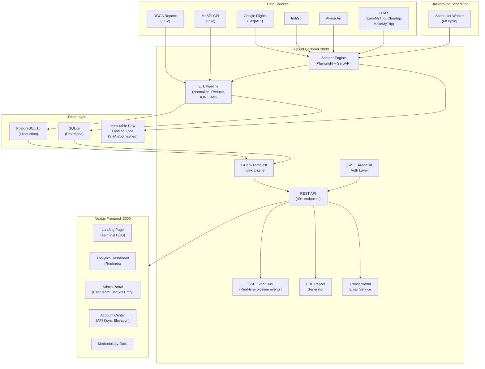
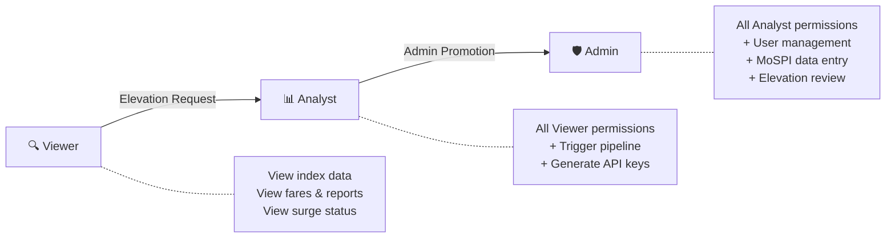
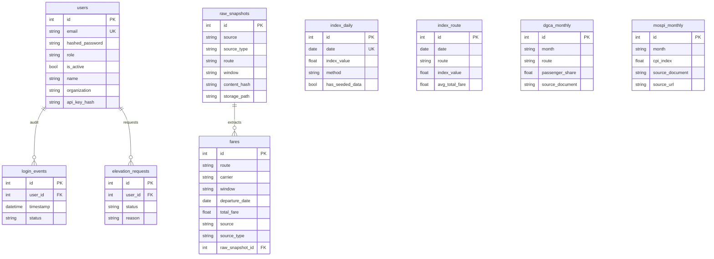

<p align="center">
  
</p>

<h1 align="center">AeroCPI — Real-time Airfare Price Index for India</h1>

<p align="center">
  <strong>A high-frequency, multilateral airfare price index platform augmenting MoSPI/NSO CPI transport sector data.</strong>
</p>

<p align="center">
  
  
  
  
  
  
</p>

---

## Table of Contents

- [Overview](#overview)
- [Architecture](#architecture)
- [Data Pipeline Workflow](#data-pipeline-workflow)
- [Key Features](#key-features)
- [Technology Stack](#technology-stack)
- [Getting Started](#getting-started)
  - [Docker Compose (Recommended)](#1-docker-compose-recommended-for-production)
  - [Local Development](#2-local-development-sqlite)
- [Environment Variables](#environment-variables)
- [API Reference](#api-reference)
- [Authentication & RBAC](#authentication--rbac)
- [Frontend Pages](#frontend-pages)
- [Index Methodology](#index-methodology)
- [Official Data Sources](#official-data-sources)
- [Test Suite](#test-suite)
- [Project Structure](#project-structure)

---

## Overview

**AeroCPI** (Aeronautical Consumer Price Index) is an automated platform that collects live airfare data across Indian domestic routes and computes a multilateral **GEKS-Törnqvist** price index — the same methodology recommended by **Eurostat** and **ILO** for official price statistics.

The platform benchmarks against two official government data sources:
- **MoSPI** (Ministry of Statistics & Programme Implementation) — CPI Division 07.3: Passenger Transport Services (Base 2024=100)
- **DGCA** (Directorate General of Civil Aviation) — Monthly Air Transport Domestic Passenger Yield & Traffic Share

### Why AeroCPI?

India's official CPI transport sub-index is published **monthly** with a 6–8 week lag. Airfares exhibit **daily** volatility driven by dynamic pricing algorithms, seasonal demand, and advance-booking windows. AeroCPI bridges this observability gap with:

- **Daily frequency** vs. monthly government releases
- **Multilateral transitivity** eliminating chain drift ($P(r,s) \times P(s,t) = P(r,t)$)
- **Transparent provenance** — every data point is tagged `live` or `seeded`
- **Real-time surge detection** with configurable thresholds

---

## Architecture



---

## Data Pipeline Workflow

```mermaid
flowchart LR
    subgraph Collect["1. Collection"]
        A1["Scrape 6 routes ×<br/>3 advance windows<br/>(T+7, T+15, T+30)"]
        A2["SerpAPI Google Flights<br/>+ Playwright headless"]
        A3["Anti-bot detection<br/>& ethical skip"]
    end

    subgraph Land["2. Immutable Landing"]
        B1["Store raw JSON<br/>in data/raw/"]
        B2["SHA-256 content<br/>hash per snapshot"]
        B3["Tag source_type:<br/>live | seeded"]
    end

    subgraph Transform["3. ETL"]
        C1["Normalize fare<br/>components<br/>(base + tax + UDF<br/>+ convenience)"]
        C2["IQR outlier<br/>filtering"]
        C3["Deduplication<br/>(carrier + flight<br/>+ route + date)"]
    end

    subgraph Index["4. Index Computation"]
        D1["Bilateral Törnqvist<br/>log-price ratios"]
        D2["GEKS multilateral<br/>geometric mean"]
        D3["DGCA traffic-share<br/>weighting (PSD)"]
    end

    subgraph Validate["5. Benchmarking"]
        E1["DGCA backtest<br/>(Pearson r, RMS-TE)"]
        E2["MoSPI CPI overlay<br/>(Div 07.3)"]
        E3["Surge detection<br/>(≥ 20% threshold)"]
    end

    Collect --> Land --> Transform --> Index --> Validate
```



---

## Key Features

### 🛩️ Automated Collection Engine
- Scrapes live fares across **6 domestic routes**: `DEL-BOM`, `DEL-BLR`, `BOM-BLR`, `DEL-CCU`, `BLR-HYD`, `MAA-DEL`
- **3 advance booking windows**: T+7 (short-haul), T+15 (medium), T+30 (long-haul)
- Sources: **IndiGo**, **Akasa Air**, **EaseMyTrip**, **Cleartrip**, **MakeMyTrip**, **Google Flights** (via SerpAPI)
- Resilient anti-bot handling: detect → skip → log → retry with backoff
- **Ethical scraping commitment** — enterprise bot protection (Akamai, CAPTCHA) is respected, not circumvented

### 📊 Multilateral GEKS-Törnqvist Index
- Implements the **Eurostat/ILO recommended** GEKS-Törnqvist algorithm
- Eliminates chain drift and preserves transitivity
- Weighted by official **DGCA domestic passenger traffic shares** (PSD)
- Observation-date time axis aligned with CPI methodology

### 🏛️ Government Benchmark Integration
- **MoSPI CPI** Division 07.3 (Base 2024=100) — 21 months of historical data auto-ingested
- **DGCA** Monthly Air Transport Reports — passenger yield & traffic statistics
- Strict **provenance validation** (`source_document`, `publication_date`, `source_url`)
- Tracking metrics: Pearson correlation and RMS Tracking Error

### 🔐 Institutional Security
- **JWT + Argon2id** authentication with configurable token expiry
- **Three-tier RBAC**: Viewer → Analyst → Admin
- **Programmatic API Keys** (`X-API-Key` header) with SHA-256 hashed storage
- **Elevation workflow**: Viewers request Analyst access → Admin review queue → Email notification
- Complete **login audit trail** per user

### 🖥️ Terminal-HUD Dashboard
- Amber/green terminal aesthetic (`--bg-void: #0A0A07`, `--accent-amber: #C9A227`, `--signal-green: #7FB86B`)
- **4 interaction effects**: scroll-driven SVG flight arc, headline decrypt/scramble, dual-layer dot-grid spotlight, directional aircraft cursor
- Live rotating AeroCPI logo with radar sweep animation
- Real-time SSE pipeline execution logs
- Surge alert toasts and materiality gap analysis

### 📄 Reporting & Export
- Server-side **PDF reports** with Matplotlib charts, provenance banners, source scorecards
- Coverage matrix (6 sources × 18 route-window combinations)
- Fare-class breakdown with live vs seeded provenance counts
- Advance-purchase elasticity curves

### ⚙️ Autonomous Operation
- **Background scheduler** runs every 6 hours (configurable), executing full scrape + index recomputation cycle
- Docker Compose brings up all 4 services with a single command
- Auto-ingest official benchmark datasets on startup

---

## Technology Stack

| Layer | Technology |
|---|---|
| **Backend API** | FastAPI 0.115+, Python 3.11+ |
| **ORM** | SQLModel (SQLAlchemy 2.0) |
| **Database** | PostgreSQL 16 (production), SQLite (development) |
| **Authentication** | PyJWT + Argon2id (argon2-cffi) |
| **Scraping** | Playwright (Chromium) + SerpAPI |
| **Index Engine** | NumPy, SciPy, Pandas |
| **PDF Reports** | ReportLab + Matplotlib |
| **Frontend** | Next.js 14.2 (App Router), React 18, TypeScript 5.6 |
| **Styling** | Tailwind CSS 3.4, Framer Motion |
| **Charts** | Recharts 2.12 |
| **Icons** | Lucide React |
| **Containerization** | Docker, Docker Compose 3.8 |
| **Testing** | pytest 8.3+ |

---

## Getting Started

### Prerequisites

- **Docker** & **Docker Compose** (for production deployment)
- **Python 3.11+** & **Node.js 20+** (for local development)
- **SerpAPI key** (optional — for live Google Flights data)

### 1. Docker Compose (Recommended for Production)

```bash
# Clone the repository
git clone https://github.com/Pawanrudupa/AeroCPI.git
cd AeroCPI

# Configure environment
cp .env.example .env
# Edit .env with your secrets (JWT_SECRET, passwords, SerpAPI key, SMTP)

# Launch all services
docker-compose up --build
```

This starts **4 services**:

| Service | Container | Port | Description |
|---|---|---|---|
| `postgres` | `aerocpi_postgres` | 5432 | PostgreSQL 16 Alpine with health checks |
| `backend` | `aerocpi_backend` | 8000 | FastAPI API server |
| `frontend` | `aerocpi_frontend` | 3000 | Next.js production build |
| `scheduler` | `aerocpi_scheduler` | — | Background scraper (6h cycle) |

**Access Points:**
- 🖥️ **Dashboard**: [http://localhost:3000](http://localhost:3000)
- 📡 **API Docs** (Swagger): [http://localhost:8000/docs](http://localhost:8000/docs)
- 💚 **Health Probe**: [http://localhost:8000/health](http://localhost:8000/health)

### 2. Local Development (SQLite)

#### Backend

```bash
# Install Python dependencies
pip install -r backend/requirements.txt

# Install Playwright browsers (for scraping)
playwright install chromium

# Configure environment
cp .env.example .env
# Edit .env with your secrets

# Initialize database, seed users, and ingest benchmark data
python -c "
from backend.app.database import create_db_and_tables, init_seed_user, engine
from sqlmodel import Session
from backend.app.scraper.basket_runner import run_full_basket_pipeline
from backend.app.index.geks import calculate_and_save_daily_indices
from backend.app.dgca.ingestion import ingest_dgca_csv
from backend.app.mospi.ingestion import ingest_mospi_csv

create_db_and_tables()
session = Session(engine)
init_seed_user(session)
ingest_dgca_csv(session, 'data/dgca/verified_dgca_reports.csv')
ingest_mospi_csv(session, 'data/mospi/verified_mospi_cpi.csv')
run_full_basket_pipeline(session, limit_sources=True)
calculate_and_save_daily_indices(session)
print('Database initialized!')
"

# Start FastAPI server
uvicorn backend.app.main:app --host 0.0.0.0 --port 8000 --reload
```

#### Frontend

```bash
cd frontend
npm install
npm run dev
```

Open [http://localhost:3000](http://localhost:3000) in your browser.

#### Background Scheduler (Optional)

```bash
# Run once (for cron/Airflow integration)
python -m backend.app.scheduler --once

# Run continuously (every 6 hours)
python -m backend.app.scheduler --interval-minutes 360
```

---

## Environment Variables

All configuration is managed via `.env` (loaded by Pydantic BaseSettings):

| Variable | Required | Default | Description |
|---|---|---|---|
| `DATABASE_URL` | No | `sqlite:///./aerocpi.db` | Database connection string. Use PostgreSQL for production. |
| `JWT_SECRET` | **Yes** | dev default | HMAC secret for signing JWT tokens. **Change in production.** |
| `JWT_ALGORITHM` | No | `HS256` | JWT signing algorithm |
| `ACCESS_TOKEN_EXPIRE_MINUTES` | No | `1440` (24h) | Token validity duration in minutes |
| `BOOTSTRAP_ADMIN_PASSWORD` | **Yes** | — | Password for bootstrap admin account |
| `SEED_ADMIN_EMAIL` | No | `admin@aerocpi.local` | Admin account email |
| `SEED_ANALYST_PASSWORD` | No | — | Password for seed analyst account |
| `SEED_ANALYST_EMAIL` | No | `demo.analyst@aerocpi.local` | Analyst account email |
| `SERPAPI_API_KEY` | No | — | SerpAPI key for Google Flights live data |
| `RAW_STORAGE_DIR` | No | `./data/raw` | Immutable raw snapshot storage directory |
| `SURGE_THRESHOLD_PCT` | No | `20.0` | Percentage threshold for surge alerts |
| `GEMINI_API_KEY` | No | — | Google Gemini Flash key for LLM fallback |
| `ADMIN_NOTIFICATION_EMAIL` | No | — | Email for elevation & MoSPI overlap alerts |
| `SMTP_HOST` | No | — | SMTP server (e.g., `smtp.gmail.com`) |
| `SMTP_PORT` | No | `587` | SMTP port |
| `SMTP_USER` | No | — | SMTP login username |
| `SMTP_PASSWORD` | No | — | SMTP login password / app password |
| `SMTP_FROM_EMAIL` | No | — | Sender address for notifications |
| `SMTP_USE_TLS` | No | `true` | Enable STARTTLS |
| `APP_BASE_URL` | No | `http://localhost:3000` | Frontend URL for email links |

---

## API Reference

The API exposes **40+ endpoints** organized by functional domain. Full interactive documentation is available at `/docs` (Swagger UI).

### System

| Method | Endpoint | Auth | Description |
|---|---|---|---|
| `GET` | `/health` | Public | Health probe with service metadata |

### Authentication

| Method | Endpoint | Auth | Description |
|---|---|---|---|
| `POST` | `/auth/token` | Public | OAuth2 password form login |
| `POST` | `/auth/login` | Public | JSON body login (frontend) |
| `POST` | `/auth/register` | Public | Self-service viewer registration |

### Public Data

| Method | Endpoint | Auth | Description |
|---|---|---|---|
| `GET` | `/public/activity-summary` | Public | Landing page activity ticker (60s cache) |
| `GET` | `/public/materiality-gap` | Public | Empirical materiality gap analysis |

### Price Index

| Method | Endpoint | Auth | Description |
|---|---|---|---|
| `GET` | `/index/daily` | User | Daily GEKS-Törnqvist index series |
| `GET` | `/index/route/{pair}` | User | Route-specific index & fare history |
| `GET` | `/index/weekly` | User | ISO weekly index (geometric mean) |
| `GET` | `/index/monthly` | User | Monthly index with MoSPI CPI overlay |

### Fares & Telemetry

| Method | Endpoint | Auth | Description |
|---|---|---|---|
| `GET` | `/fares/raw` | User | Cleaned fare quotes with filters |
| `GET` | `/fares/export-pdf` | User | Download PDF report |
| `GET` | `/reports/fare-class-breakdown` | User | Economy fare breakdown by route |
| `GET` | `/reports/coverage-matrix` | User | 6×18 source-route coverage matrix |
| `GET` | `/reports/materiality-gap` | User | Materiality gap (gated version) |
| `GET` | `/reports/export-pdf` | User | PDF report (alias) |

### Validation & Backtest

| Method | Endpoint | Auth | Description |
|---|---|---|---|
| `GET` | `/backtest/dgca` | User | DGCA comparative backtest (Pearson r, RMS-TE) |

### Pipeline Operations

| Method | Endpoint | Auth | Description |
|---|---|---|---|
| `POST` | `/pipeline/trigger-sync` | Analyst+ | Synchronous scrape + index recomputation |
| `POST` | `/pipeline/trigger-sync-sse` | Analyst+ | Async pipeline with SSE progress stream |
| `POST` | `/pipeline/stop` | Analyst+ | Graceful pipeline stop |
| `GET` | `/pipeline/surge-status` | User | Surge detection across all route-windows |
| `GET` | `/pipeline/elasticity` | User | Advance-purchase elasticity curve |
| `GET` | `/events/pipeline` | Token | Real-time SSE event stream |

### Account Management

| Method | Endpoint | Auth | Description |
|---|---|---|---|
| `GET` | `/account/profile` | User | User profile details |
| `PATCH` | `/account/profile` | User | Update name/organization |
| `POST` | `/account/change-password` | User | Change password |
| `GET` | `/account/login-history` | User | Last 25 login audit events |
| `POST` | `/account/api-key` | Analyst+ | Generate/regenerate API key |
| `DELETE` | `/account/api-key` | Analyst+ | Revoke API key |
| `POST` | `/account/elevation-request` | User | Request Analyst elevation |
| `GET` | `/account/elevation-request` | User | Check elevation request status |

### Administration

| Method | Endpoint | Auth | Description |
|---|---|---|---|
| `GET` | `/admin/users` | Admin | List all user accounts |
| `POST` | `/admin/users` | Admin | Provision new institutional user |
| `PATCH` | `/admin/users/{id}/status` | Admin | Activate/deactivate account |
| `PATCH` | `/admin/users/{id}/role` | Admin | Change user role |
| `POST` | `/admin/users/{id}/reset-password` | Admin | Force password reset |
| `POST` | `/admin/mospi-benchmark` | Admin | Record MoSPI CPI data point |
| `GET` | `/admin/elevation-requests` | Admin | List elevation requests |
| `POST` | `/admin/elevation-requests/{id}/approve` | Admin | Approve elevation |
| `POST` | `/admin/elevation-requests/{id}/reject` | Admin | Reject elevation |
| `GET` | `/admin/email-log` | Admin | Transactional email audit log |

---

## Authentication & RBAC

### Role Hierarchy



### Authentication Methods

1. **JWT Bearer Token** — Obtained via `/auth/login` or `/auth/token`. Include as `Authorization: Bearer <token>`.
2. **API Key** — Generated at `/account/api-key`. Include as `X-API-Key: <key>` header.

### Seed Accounts

| Account | Email | Role | Password Source |
|---|---|---|---|
| Admin | `admin@aerocpi.local` | Admin | `BOOTSTRAP_ADMIN_PASSWORD` env var |
| Analyst | `demo.analyst@aerocpi.local` | Analyst | `SEED_ANALYST_PASSWORD` env var |

### Example: Obtain a Token

```bash
curl -X POST http://localhost:8000/auth/login \
  -H "Content-Type: application/json" \
  -d '{"email": "demo.analyst@aerocpi.local", "password": "YourEnvPasswordHere"}'
```

---

## Frontend Pages

| Route | Page | Access | Description |
|---|---|---|---|
| `/` | Landing Page | Public | Terminal-HUD hero with flight arc animation, live activity ticker, materiality gap summary |
| `/login` | Login | Public | JWT authentication portal |
| `/signup` | Sign Up | Public | Self-service viewer registration |
| `/dashboard` | Analytics Dashboard | Authenticated | GEKS daily index chart, route cards, pipeline controls, SSE logs, surge alerts |
| `/dashboard/reports` | Reports | Authenticated | Coverage matrix, fare breakdown, elasticity curve, materiality gap, PDF export |
| `/dashboard/route/[pair]` | Route Deep Dive | Authenticated | Route-level index history and fare trajectory (e.g., `/dashboard/route/DEL-BOM`) |
| `/account` | Account Center | Authenticated | Profile settings, password change, API key management, elevation requests |
| `/admin/users` | Admin Portal | Admin only | User management, elevation review queue, MoSPI entry, email log |
| `/methodology` | Methodology | Public | Full index methodology documentation |

### UI Components (21 Components)

`AeroCPILogo` · `CommandBar` · `DecryptText` · `DirectionalPlaneCursor` · `DotGridSpotlight` · `ElasticityCurve` · `GlobalPlaneCursor` · `HeaderActions` · `HeatmapMatrix` · `HeroScrollFlight` · `HoverExpandCard` · `InstitutionalNavbar` · `LiveActivityStrip` · `LiveTrendChart` · `MaterialityGapSection` · `PipelineLogConsole` · `QuoteTable` · `RadarBackground` · `SurgeToast` · `TooltipGlossary` · `TrendIndicator`

---

## Index Methodology

### GEKS-Törnqvist Multilateral Formula

The headline index uses the GEKS (Gini-Eltetö-Köves-Szulc) extension of bilateral Törnqvist price indices — the method recommended by Eurostat and ILO for official price statistics.

**Step 1 — Bilateral Törnqvist Log Price Ratio:**

$$\ln P_T(0, t) = \sum_{i \in \text{common}} w_i \cdot \ln\left(\frac{p_{i,t}}{p_{i,0}}\right)$$

**Step 2 — Multilateral GEKS Aggregation:**

$$\ln P_{\text{GEKS}}(0, t) = \frac{1}{|T|} \sum_{k \in T} \left[\ln P_T(0, k) - \ln P_T(t, k)\right]$$

$$P_{\text{GEKS}}(0, t) = 100.0 \times \exp(\text{mean\_log})$$

### Key Properties

| Property | Guarantee |
|---|---|
| **Transitivity** | $P(r,s) \times P(s,t) = P(r,t)$ |
| **Base invariance** | No chain drift across window extensions |
| **Identity** | $P(t,t) = 100.0$ |

### Route Basket & DGCA Traffic Weights

| Route | Weight | Traffic Share |
|---|---|---|
| DEL-BOM | 0.24 | 24% |
| DEL-BLR | 0.20 | 20% |
| BOM-BLR | 0.18 | 18% |
| DEL-CCU | 0.15 | 15% |
| BLR-HYD | 0.12 | 12% |
| MAA-DEL | 0.11 | 11% |

### Time Axis Convention

The index uses **observation date** (price at time of scrape), not flight departure date. This aligns with standard CPI methodology — measuring the price a consumer faces at the moment of purchase.

---

## Official Data Sources

### MoSPI CPI (Division 07.3)

- **Dataset**: `data/mospi/verified_mospi_cpi.csv`
- **Coverage**: 21 monthly records (January 2025 – September 2026)
- **Base**: 2024 = 100 (All-India Combined)
- **Provenance**: Each record carries `source_document`, `publication_date`, and `source_url`

### DGCA Monthly Air Transport

- **Dataset**: `data/dgca/verified_dgca_reports.csv`
- **Coverage**: 31 records (January 2026 – May 2026 across 6 routes)
- **Fields**: Average fare (INR), passenger share (PSD weight), passenger count
- **Provenance**: Report title, publication date, and URL

### Raw Scrape Archive

- **Location**: `data/raw/`
- **Format**: Immutable JSON snapshots with SHA-256 content hashes
- **Naming**: `{source_type}_{source}_{route}_{window}_{timestamp}.json`
- **1,190+ snapshots** across all sources, routes, and booking windows

---

## Test Suite

The project includes **36 automated tests** covering unit, contract, mathematical, and API integration testing.

```bash
# Run the full test suite
python -m pytest tests/ -v

# Run with coverage
python -m pytest tests/ -v --tb=short
```

### Test Breakdown

| Test File | Tests | Coverage Area |
|---|---|---|
| `test_api.py` | 3 | Health endpoint, auth gating, token flow |
| `test_database.py` | 5 | Password hashing, user CRUD, model integrity, provenance |
| `test_dgca_backtest.py` | 3 | DGCA provenance, ingestion, overlap detection |
| `test_geks_index.py` | 4 | Identity, proportionality, transitivity, aggregation |
| `test_mospi_ingestion.py` | 3 | CSV ingestion, provenance enforcement, upsert |
| `test_multi_source.py` | 2 | Multi-carrier scraping, multi-route pipeline |
| `test_pipeline_completeness.py` | 3 | Fare-class cleaning, sold-out handling, weekly/monthly aggregation |
| `test_reports_pdf.py` | 3 | Chart rendering, PDF structure, export endpoints |
| `test_scraper_and_etl.py` | 6 | Storage immutability, fare normalization, IQR filtering, dedup, bot detection, E2E pipeline |
| `test_serpapi.py` | 4 | Google Flights parsing, carrier filtering, mocked fetch, E2E |

All tests run on **SQLite with in-memory isolation** — no external services required.

### Additional Integration Test Scripts

| Script | Description |
|---|---|
| `test_admin_account.py` | 7-step admin bootstrap, provisioning, password reset, API key lifecycle |
| `test_elevation_and_email.py` | 8-step elevation workflow, email dispatch, duplicate guards, RBAC |

---

## Project Structure

```
AeroCPI/
├── backend/
│   ├── app/
│   │   ├── main.py              # FastAPI application (40+ endpoints)
│   │   ├── config.py            # Pydantic BaseSettings configuration
│   │   ├── models.py            # SQLModel ORM (9 database models)
│   │   ├── database.py          # Engine, session, seed initialization
│   │   ├── security.py          # JWT, Argon2id, API key utilities
│   │   ├── scheduler.py         # Background scraping scheduler (CLI)
│   │   ├── events.py            # SSE event bus for pipeline telemetry
│   │   ├── email_service.py     # Transactional email (SMTP)
│   │   ├── index/
│   │   │   └── geks.py          # GEKS-Törnqvist multilateral engine
│   │   ├── scraper/
│   │   │   ├── basket_runner.py # Full basket pipeline orchestrator
│   │   │   ├── indigo.py        # IndiGo scraper (Playwright)
│   │   │   ├── akasa.py         # Akasa Air scraper (Playwright)
│   │   │   ├── easemytrip.py    # EaseMyTrip scraper (Playwright)
│   │   │   ├── cleartrip.py     # Cleartrip scraper (Playwright)
│   │   │   ├── makemytrip.py    # MakeMyTrip scraper (Playwright)
│   │   │   ├── spicejet.py      # SpiceJet scraper (Playwright)
│   │   │   ├── serpapi_scraper.py # Google Flights via SerpAPI
│   │   │   └── seeder.py        # Calibrated fallback data seeder
│   │   ├── dgca/
│   │   │   ├── ingestion.py     # DGCA CSV ingestion with provenance
│   │   │   └── backtest.py      # DGCA backtest (Pearson r, RMS-TE)
│   │   ├── mospi/
│   │   │   └── ingestion.py     # MoSPI CPI CSV ingestion with provenance
│   │   └── reports/
│   │       └── pdf_generator.py # Server-side PDF report (ReportLab)
│   ├── Dockerfile               # Python 3.11-slim with Playwright
│   └── requirements.txt         # Python dependencies
├── frontend/
│   ├── app/                     # Next.js 14 App Router pages
│   │   ├── page.tsx             # Landing page (Terminal HUD)
│   │   ├── layout.tsx           # Root layout with metadata & icons
│   │   ├── login/page.tsx       # Authentication portal
│   │   ├── signup/page.tsx      # Self-service registration
│   │   ├── account/page.tsx     # Account center
│   │   ├── admin/users/page.tsx # Admin portal
│   │   ├── dashboard/
│   │   │   ├── page.tsx         # Analytics dashboard
│   │   │   ├── layout.tsx       # Dashboard shell & navbar
│   │   │   ├── reports/page.tsx # Reports & telemetry
│   │   │   └── route/[pair]/page.tsx  # Route deep dive
│   │   └── methodology/page.tsx # Methodology documentation
│   ├── components/              # 21 React components
│   ├── lib/
│   │   ├── api.ts               # Typed API client
│   │   └── auth.tsx             # JWT auth context provider
│   ├── public/                  # Static assets (logo, favicon, icons)
│   ├── Dockerfile               # Multi-stage Node.js 20 Alpine build
│   └── package.json             # Frontend dependencies
├── data/
│   ├── dgca/verified_dgca_reports.csv   # Official DGCA benchmark data
│   ├── mospi/verified_mospi_cpi.csv     # Official MoSPI CPI data
│   └── raw/                             # Immutable scrape landing zone
├── tests/                       # 36 automated tests (10 files)
├── docker-compose.yml           # 4-service orchestration
├── METHODOLOGY.md               # Index methodology documentation
├── .env.example                 # Environment variable template
├── .gitignore
└── README.md
```

---

## Database Schema



---

## Ethical Scraping Policy

AeroCPI follows a strict **ethical scraping commitment**:

- ✅ Respects `robots.txt` directives
- ✅ Implements polite request intervals with exponential backoff
- ✅ Detects and **skips** enterprise bot protection (Akamai Bot Manager, CAPTCHA) — never circumvents
- ✅ Tags all data with transparent provenance (`live` vs `seeded`)
- ✅ Falls back to calibrated seeded data (honestly labeled) when live collection is blocked
- ❌ No residential proxy rotation
- ❌ No aggressive fingerprint spoofing

---

<p align="center">
  <strong>Built for transparency in price statistics.</strong>
  <br/>
  <sub>AeroCPI — Augmenting official CPI transport metrics with high-frequency, methodology-compliant airfare intelligence.</sub>
</p>
